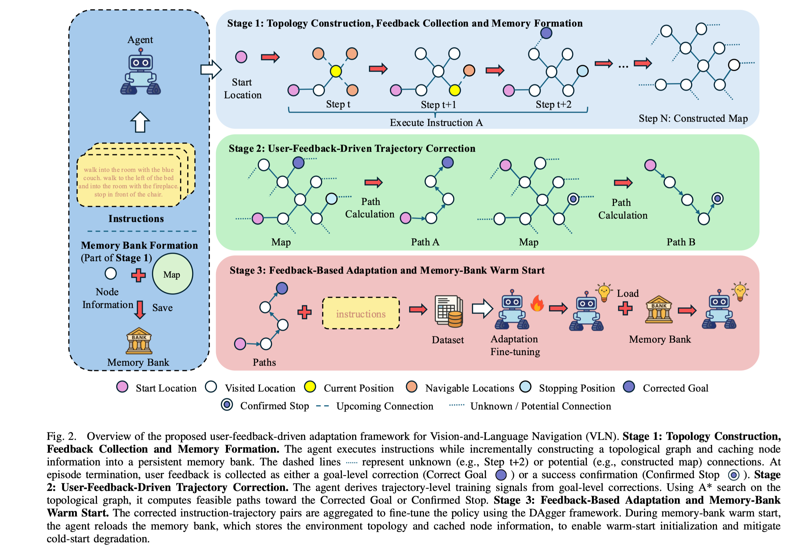

# User-Feedback-Driven Adaptation for Vision-and-Language Navigation
Real-world deployment of Vision-and-Language Navigation (VLN) agents is constrained by the scarcity of reliable supervision after offline training. While recent adaptation methods attempt to mitigate distribution shifts via environment-driven self-supervision (e.g., entropy minimization), these signals are often noisy and can make the agent amplify its own mistakes during long-horizon sequential decision-making. In this paper, we propose a paradigm shift that positions user feedback, specifically episode-level success confirmations and goal-level corrections, as a primary, general-purpose supervision signal for VLN. Unlike internal confidence scores, user feedback is intent-aligned and in-situ consistent, directly correcting the agent's decoupling from user instructions. To effectively leverage this supervision, we introduce a user-feedback-driven learning framework featuring a topology-aware trajectory construction pipeline. This mechanism "lifts" sparse, goal-level corrections into dense path-level supervision. It does so by generating feasible paths on the agent’s incrementally built topological graph, enabling sample-efficient imitation learning without requiring step-by-step human demonstrations. Furthermore, we develop a persistent memory-bank mechanism for warm-start initialization, supporting the reuse of previously acquired topology and cached representations across navigation sessions. Extensive experiments on the GSA-R2R benchmark demonstrate that our approach transforms sparse interaction into robust supervision, consistently outperforming environment-driven baselines while exhibiting strong adaptability across diverse instruction styles.

 

<em>Figure 1: Overview of the Feedback-Driven Adaptation Mechanism.</em> 
