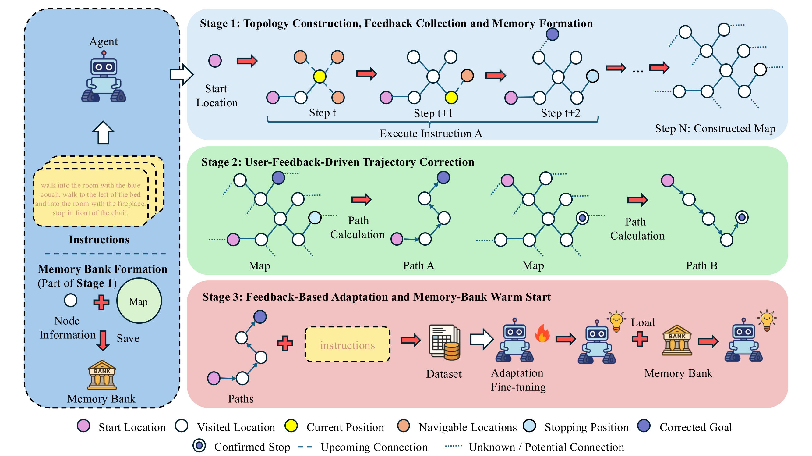

# User-Feedback-Driven Adaptation for Vision-and-Language Navigation

[[Paper (IEEE TMM)](https://doi.org/10.1109/TMM.2026.3724731)] [[arXiv](https://arxiv.org/abs/2512.10322)] [[Data & Checkpoints](https://huggingface.co/Peachilk/UFD)]

<div align="center"> 


<em>Figure 1: Overview of the Feedback-Driven Adaptation Framework. Figure from our IEEE TMM paper, © 2026 IEEE.</em> </div>

## Code Structure

```
map_nav_src/
├── r2r/
│   ├── main_nav_with_all_scan.py    # fine-tuning with reconstructed paths
│   ├── main_nav_cache_all_scan.py   # memory bank generation and evaluation
│   └── agent.py, env.py, ...        # GR-DUET agent and environment
├── tool/path_reconstruction.py      # topology-aware path reconstruction
├── models/, utils/
└── scripts/
    ├── path_reconstruction.sh
    ├── run_gsa_r2r.sh
    └── cache_all_scan.sh
dataset_construction/
├── get_pano_inputs.py               # precomputed panorama inputs
└── build_scanvp_cands.py            # precomputed candidate viewpoints
```

## Installation

1. Install the [Matterport3D Simulator](https://github.com/peteanderson80/Matterport3DSimulator) as in [VLN-DUET](https://github.com/cshizhe/VLN-DUET) and add it to `PYTHONPATH`:
   ```bash
   export PYTHONPATH=Matterport3DSimulator/build:$PYTHONPATH
   ```
   Rendering is disabled in this code (all visual features are precomputed), so only the connectivity graphs are needed.
2. Install the Python dependencies:
   ```bash
   pip install torch transformers numpy h5py networkx jsonlines tqdm wandb
   ```
   [apex](https://github.com/NVIDIA/apex) is optional; without it, `torch.nn.LayerNorm` is used.

## Data

All data and checkpoints go under `data/` in the repository root. The scripts point to it with `DATA_DIR=../data`, relative to `map_nav_src/`.

1. **Our data and checkpoint** (reconstructed training sets, validation and test splits, precomputed inputs and the fine-tuned model):
   ```bash
   huggingface-cli download Peachilk/UFD --local-dir data
   ```
2. **Connectivity graphs and CLIP features** from [ScaleVLN](https://github.com/wz0919/ScaleVLN): unzip `r2r_preprocess_data.zip` and `features.zip` from their [HuggingFace dataset](https://huggingface.co/datasets/OpenGVLab/ScaleVLN). Put the `connectivity/` folder in `data/` and `clip_vit-b16_mp3d_hm3d_gibson.hdf5` in `data/features/`.
3. **Augmentation data**: copy `Train/prevalent_aug_train_enc.json` from the GSA-R2R dataset released by [GSA-VLN](https://github.com/honghd16/GSA-VLN) to `data/GSA_Dataset/Train/`.
4. **Initial model**: download the fine-tuned GR-DUET checkpoint released by [GSA-VLN](https://github.com/honghd16/GSA-VLN) and save it as `data/ckpts/best_val_unseen`.

The resulting layout:

```
data/
├── GSA_Dataset/
│   ├── Train/                       # R2R_train_enc.json, prevalent_aug_train_enc.json
│   ├── Validation/Residential/Reconstruction/validation_set_100.json
│   └── Test/Residential/
│       ├── Reconstruction/merged_test_dataset.json
│       └── Recmixed/merged_test_dataset.json
├── split_basic/split_test_500_<scan>.json
├── split_mixed/split_test_500_<scan>.json
├── rec_basic/                       # merged_train_dataset.json, merged_500_test_dataset.json
├── rec_mixed/                       # merged_train_dataset.json, merge_500_test_dataset_mixed.json
├── scanvp_cands_relangles_with_habitat.json
├── pano_inputs_habitats_more_scan.h5
├── connectivity/
├── features/clip_vit-b16_mp3d_hm3d_gibson.hdf5
└── ckpts/                           # best_val_unseen, best_overall_iter_23500
```

- `basic` uses the Basic instructions of GSA-R2R and is the default setting; `mixed` combines instructions in five user styles (child, keith, moira, rachel, sheldon).
- For each scan, `split_*/split_test_500_<scan>.json` holds the 500 instructions on which user feedback is collected, and `Test/Residential/*/merged_test_dataset.json` holds 100 held-out test instructions.
- `rec_*/merged_train_dataset.json` is the training set built from the reconstructed paths, and `rec_*/merged_*500*.json` merges the 500 instructions of all scans into one file.
- The folders `Validation/Residential/Reconstruction/` and `Test/Residential/*/` must each contain exactly one file, because the code reads the first file in them.

## Usage

Run all scripts from `map_nav_src/`. Paths of outputs below are relative to the repository root. Select the GPU with `CUDA_VISIBLE_DEVICES` (e.g. `CUDA_VISIBLE_DEVICES=0 bash scripts/run_gsa_r2r.sh`); `path_reconstruction.sh` sets it through `CUDA_DEVICES` inside the script.

```bash
cd map_nav_src
```

### 1. Path reconstruction from user feedback

```bash
bash scripts/path_reconstruction.sh
```

For every scan, the pretrained GR-DUET (`best_val_unseen`) follows the 500 instructions in `data/split_basic/` and builds a topology graph as it navigates. A* then finds a path on this graph from the start to the goal given by user feedback. The results are written to `outputs/rec_basic/<scan>/astar_reconstructed_paths.json`, together with `user_feedback_data.json`.

The training set merges all scans and keeps the paths with 5 to 7 viewpoints:

```bash
python -c "import glob, json; d = [x for f in sorted(glob.glob('../outputs/rec_basic/*/astar_reconstructed_paths.json')) for x in json.load(open(f)) if 5 <= len(x['path']) <= 7]; json.dump(d, open('../outputs/rec_basic/merged_train_dataset.json', 'w'))"
```

The merged result is provided as `data/rec_basic/merged_train_dataset.json`, so this step can be skipped.

### 2. Training

```bash
bash scripts/run_gsa_r2r.sh
```

Starting from `best_val_unseen`, the agent is trained in turn on R2R, the reconstructed paths in `data/rec_basic/` and the augmentation data. Every 1,000 iterations it is evaluated on each validation scan, and checkpoints are saved to `datasets/R2R/exprs_map/finetune/ufd_basic/ckpts/`:

- `best_overall_iter_*`: best SPL averaged over the validation scans
- `best_scan_<scan>_iter_*`: best SPL on each validation scan

Training is logged to Weights & Biases (project `GR-DUET`). Run `wandb login` first, or set `WANDB_MODE=offline`. To train on the mixed setting, change `new_anno_dir` in the script to `${DATA_DIR}/rec_mixed`.

### 3. Memory bank

```bash
bash scripts/cache_all_scan.sh
```

- **Stage 1** runs the pretrained GR-DUET on the 500 instructions of each scan and saves the resulting topology graphs and node features to `datasets/Cache/multi_scans_cache/memory_bank_basic.pkl.gz`.
- **Stage 2** loads the memory bank and evaluates the fine-tuned model (`best_overall_iter_23500`) on the 100 test instructions of each scan. It is commented out in the script; uncomment it to run. The results are saved to `multi_scene_test_results.json` under `datasets/Cache/multi_scans_logs/`.

### Preprocessing (optional)

`data/` already contains the two precomputed inputs used by the agent. They can be regenerated with the scripts in `dataset_construction/`, run from the repository root:

```bash
# candidate viewpoints and relative angles of every viewpoint
python dataset_construction/build_scanvp_cands.py \
    --connectivity_dir data/connectivity \
    --output data/scanvp_cands_relangles_with_habitat.json

# panorama inputs of every viewpoint in the scans listed in scans.txt (one scan id per line; needs a GPU)
python dataset_construction/get_pano_inputs.py \
    --connectivity_dir data/connectivity \
    --img_ft_file data/features/clip_vit-b16_mp3d_hm3d_gibson.hdf5 \
    --scans_file scans.txt \
    --output_file data/pano_inputs_habitats_more_scan.h5
```

## Citation

If you find this work helpful, please cite:

```bibtex
@article{yu2026userfeedback,
  title   = {User-Feedback-Driven Adaptation for Vision-and-Language Navigation},
  author  = {Yu, Yongqiang and Li, Xuhui and Mahmood, Hazza and Zhou, Jinxing and Hong, Haodong and Jiang, Longtao and Xu, Zhiqiang and Wu, Qi and Chang, Xiaojun},
  journal = {IEEE Transactions on Multimedia},
  year    = {2026},
  doi     = {10.1109/TMM.2026.3724731}
}
```

## Acknowledgements

This code is built upon [GSA-VLN](https://github.com/honghd16/GSA-VLN) (GR-DUET), [VLN-DUET](https://github.com/cshizhe/VLN-DUET) and [ScaleVLN](https://github.com/wz0919/ScaleVLN).
